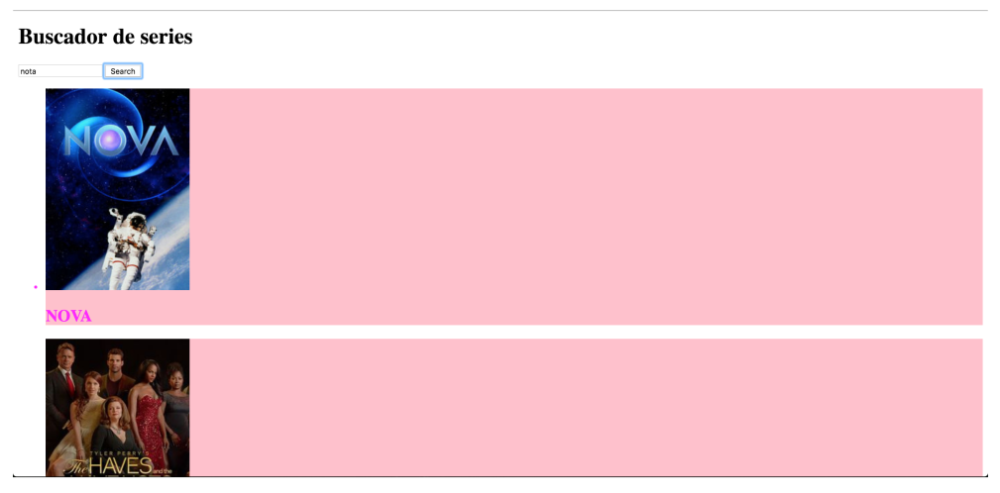
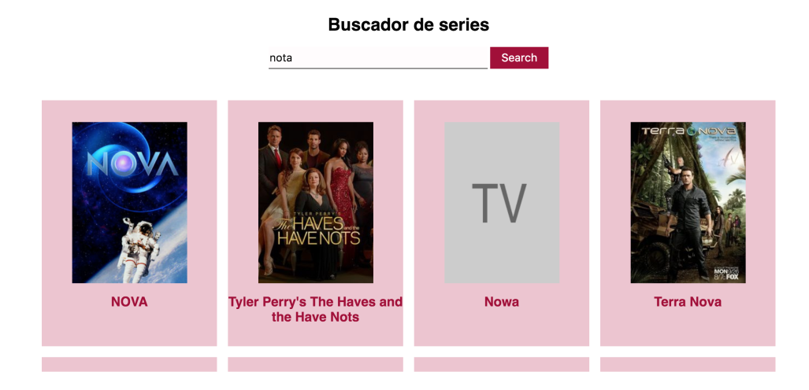

# Adalab Prueba Final Sprint 2

El ejercicio consiste en desarrollar una aplicación web de búsqueda de series de TV, donde
se aveluarán los conocimientos de JavaScript adquiridos durante el sprint. El ejercicio también
tiene una parte de maquetación con HTML y Sass.

## Hito 01:
Maquetación básica:

## Hito 02:
**Búsqueda** :

La aplicación de búsqueda de series consta de dos partes
1. Un campo de texto y un botón para buscar series por su título
2. Un listado de resultados de búsqueda donde aparece el cartel de la serie y el título
3. Por cada show contenido en el resultado de búsqueda debemos pintar una tarjeta
donde mostramos una imagen de la serie y el título.

## Hito 03:
Una vez aparecen los resultados de búsqueda, se indican cuáles son los favoritos.
Para ello, al hacer clic sobre un resultado cambia el aspecto de la tarjeta.

## BONUS 01:
Afinar la maquetación:
Se modifica la apariencia de la página propuesta levemente.

## BONUS 02:
localStorage:

Se deben guardar las favoritas en el localStorage. Funcionalidad que buscamos: por ejemplo busco Girls, entre los resultados marco una serie como favorita, hago una busqueda diferente y cambian los resultados, vuelvo a buscar Girls y veo que la serie que marqué como favorita está marcada ;)

## Sobre la autora:

Puedes espiarme en:

